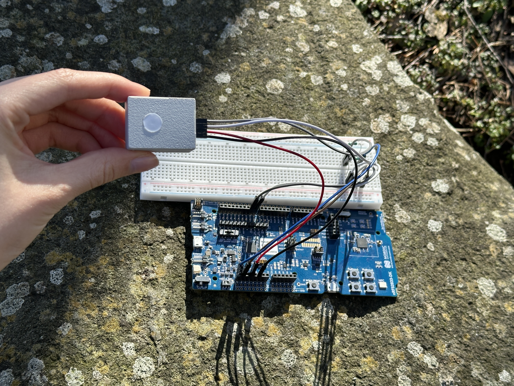

# 🌈 nRF52833 · TCS3448 Low-Power Spectral Sensing

Low-power firmware for the Nordic Semiconductor **nRF52833 DK** to interface with the **TCS3448 14-channel multi-spectral sensor** over I²C. Designed for outdoor applications such as PAR (Photosynthetically Active Radiation) monitoring and spectral analysis.




This project was developed by **Nan, Jingjie** (📧 [j23417891@gmail.com](mailto:j23417891@gmail.com)). Her full project report and poster are available here: [📄 Final Year Project Report](Report/JingjieNan_Final%20Year%20Project.pdf) · [🖼️ Poster](Report/Poster.pdf)

---

## 🔧 Hardware

| Item | Details |
|------|---------|
| MCU | nRF52833 DK (PCA10100) |
| Sensor | TCS3448 14-channel spectral sensor (ams-OSRAM) |
| Interface | I²C / TWI at 400 kHz, 3.3 V logic |
| I²C Address | `0x59` (7-bit) · Chip ID register `0x5A` returns `0x81` |

### 📌 I²C Pin Assignment

| Signal | nRF52833 Pin |
|--------|-------------|
| SDA | **P0.19** |
| SCL | **P0.17** |

> ⚠️ **External pull-up resistors required** on both SDA and SCL (4.7 kΩ to 3.3 V for 400 kHz). The firmware disables the nRF52833 internal pull-ups after TWI init to avoid conflicts.

---

## 🔬 Sensor Configuration

| Parameter | Value |
|-----------|-------|
| Gain | `TCS3448_GAIN_4X` (4×) · range: 0.5× – 2048× |
| ATIME | 35 |
| ASTEP | 999 |
| Integration time | ≈ 100 ms |

**Integration time formula:**
```
t_int = (ATIME + 1) × (ASTEP + 1) × 2.78 µs
      = 36 × 1000 × 2.78 µs ≈ 100 ms
```

### 📊 Channel Map (auto_smux = 3, 18 channels)

The sensor uses `auto_smux` mode (`CFG20 = 0x60`), routing all spectral channels across 3 internal cycles automatically. Data is read as 18 × 16-bit values starting from `ASTATUS` (0x94):

| Channel | λp typ (Table 5) | Buffer index |
|---------|-----------------|-------------|
| **F1** | 407 nm | 12 |
| **F2** | 424 nm | 6 |
| FZ | 450 nm | 0 |
| **F3** | 473 nm | 7 |
| **F4** | 516 nm | 8 |
| **F5** | 546 nm | 15 |
| FY | 560 nm | 1 |
| FXL | 596 nm | 2 |
| **F6** | 636 nm | 9 |
| **F7** | 687 nm | 13 |
| **F8** | 748 nm | 14 |
| NIR | 855 nm | 3 |
| VIS1 | Broadband | 4 |
| VIS2 | Broadband | 10 |
| VIS3 | Broadband | 16 |
| FD1 | Broadband | 5 |
| FD2 | Broadband | 11 |
| FD3 | Broadband | 17 |

### 🌿 Computed Output

**PAR** (Photosynthetically Active Radiation, µmol/m²/s) — computed via weighted non-negative least-squares regression across the F1–F8 spectral bands.

---

## ⚡ Low-Power Strategy

1. **DCDC converter** enabled (`NRF_POWER->DCDCEN = 1`)
2. **RTC2** for 1-second periodic wake-ups (32 Hz LFCLK — lower power than TIMER)
3. **`nrf_pwr_mgmt_run()`** in the main loop → WFE between events

---

## 🛠️ Software Setup & Getting Started

| Item | Details |
|------|---------|
| SDK | Nordic nRF5 SDK 17.1.0 |
| Toolchain | SEGGER Embedded Studio for ARM (v5.42a+) |
| SoftDevice | Not required |
| Logging | SEGGER RTT via J-Link on-board |

1. Copy the project folder into `nRF5_SDK_17.1.0_ddde560/examples/peripheral/`
2. Open `pca10100/blank/ses/tcs3448_pca10100.emProject` in SES
3. **Build and Debug** (F5) — RTT output is only visible with the debugger attached
4. View output in the **Debug Terminal** tab or SEGGER J-Link RTT Viewer

---

## 📁 Directory Structure

```
nRF52833-I2C-TCS3448-Low-Power-Spectral-Sensing/
├── main.c                              # App entry: RTC, sensor init, main loop
├── drivers/
│   ├── tcs3448/
│   │   ├── tcs3448.c                   # Sensor driver
│   │   ├── tcs3448.h                   # Driver API
│   │   └── tcs3448_defines.h           # Register map, enums, bit masks
│   └── i2c/
│       ├── i2c_interface.c             # TWI abstraction (nrf_drv_twi)
│       └── i2c_interface.h             # I²C API
├── pca10100/blank/ses/
│   └── tcs3448_pca10100.emProject      # SEGGER Embedded Studio project
├── pca10100/blank/config/
│   └── sdk_config.h                    # nRF5 SDK peripheral configuration
├── Report/
│   ├── JingjieNan_Final Year Project.pdf
│   └── Poster.pdf
└── TCS3448/
    └── TCS3448_DS001121_1-01.pdf       # TCS3448 datasheet
```

---

## 🩺 Troubleshooting

| Symptom | Likely Cause | Fix |
|---------|-------------|-----|
| `ANACK` on I²C | Sensor not powered | Verify 3.3 V on sensor VDD before MCU starts I²C |
| `ANACK` on every transaction | Missing pull-ups | Add 4.7 kΩ pull-ups on SDA/SCL to 3.3 V |
| ID register wrong | Wrong address or REG_BANK | `test_tcs3448_connection()` sets REG_BANK=1 via CFG0 to access 0x5A |
| No RTT output | Debug session not started | Use **Build → Debug** (F5), not just flash/run |
| All readings are 0 | Integration too short or gain too low | Increase ATIME or GAIN in `tcs3448_init_sensor()` |
| Readings saturate (65535) | Gain too high | Reduce GAIN in `tcs3448_init_sensor()` |

---

## 📚 References

- [TCS3448 Datasheet — ams-OSRAM](https://ams-osram.com)
- [nRF52833 DK — Nordic Semiconductor](https://www.nordicsemi.com/Products/nRF52833)
- [nRF5 SDK 17.1.0 Documentation](https://infocenter.nordicsemi.com/topic/sdk_nrf5_v17.1.0/index.html)
- Adapted from: [`nRF52833-I2C-AS7341-Low-Power-Spectral-Sensing`](https://github.com/daskals/nRF52833-I2C-AS7341-Low-Power-Spectral-Sensing)

---

## 📄 License

MIT License
